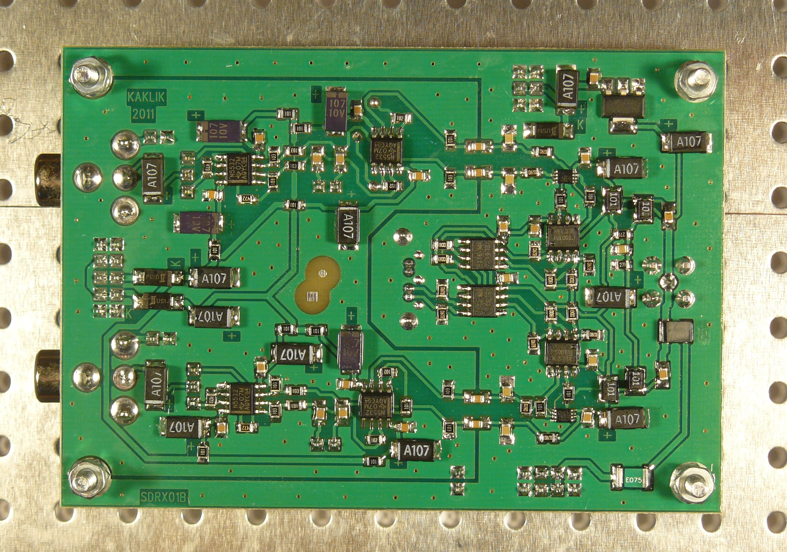
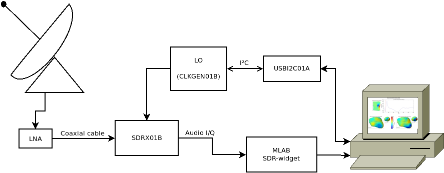

<!--- module --->
# SDRX01B - SDR Receiver
<!--- Emodule --->

<!--- subtitle --->
A improved design of well known DR2G software defined receiver. It is capable to work from almost zero frequencies up to 200MHz but up to 450MHz with selected parts.
<!--- Esubtitle --->

<!--- description --->

<!--- Edescription --->
